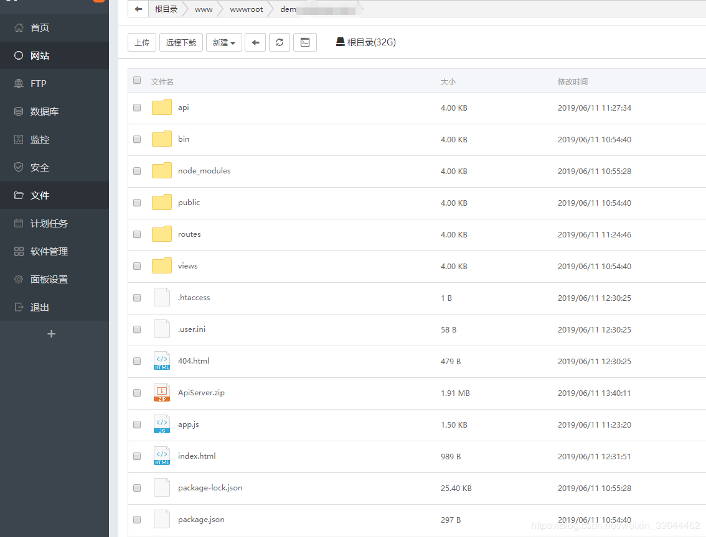
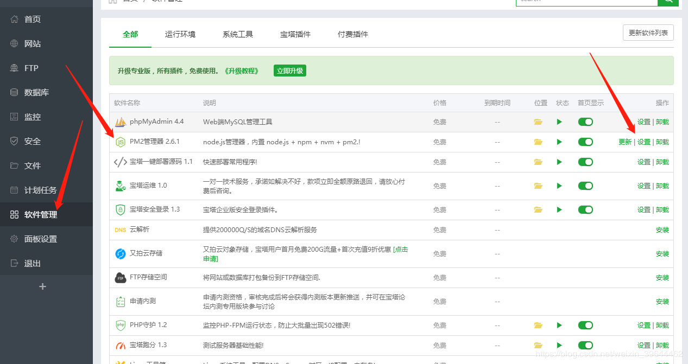
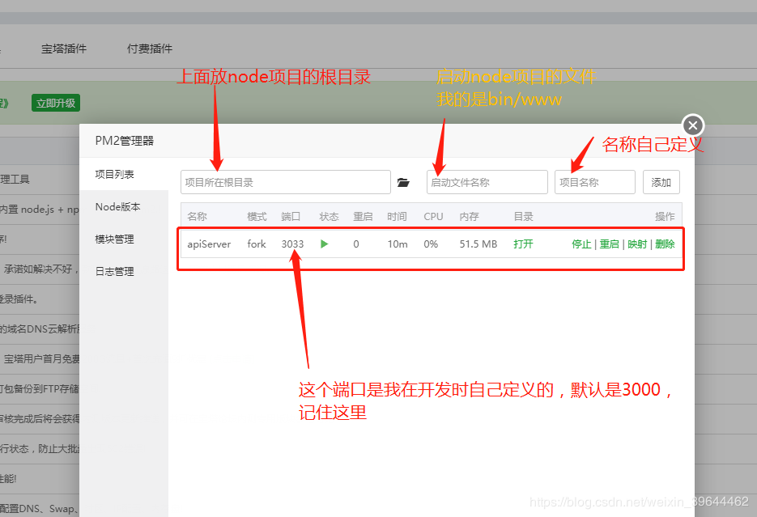
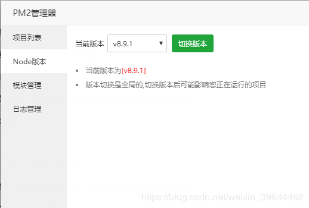
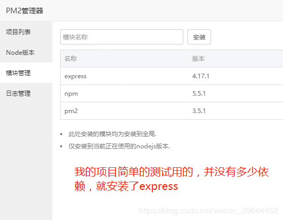
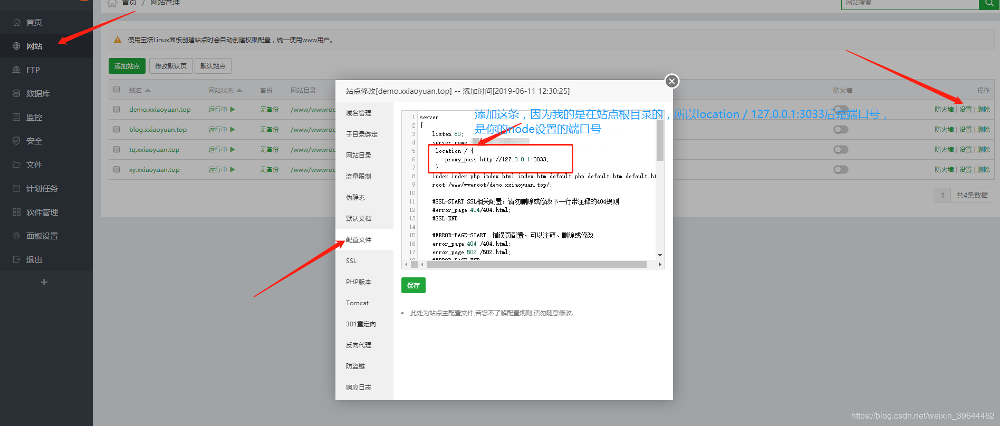

# 宝塔部署node教程


## 一、服务器

1. 服务器的话可以选择[腾讯云](https://cloud.tencent.com/)、[阿里云](www.aliyun.com)、[百度云](https://cloud.baidu.com/)等，暂时只发现服务器能够部署node，虚拟主机的话大多数都是PHP，如果你运气好的话可以找到支持node的虚拟主机。

2. 服务器镜像选择windown或者是linux都可以。我这里选择的是 CentOS 7.1 x86_64 (64bit) 

3. 选择完服务器后安装[宝塔](https://www.bt.cn/)面板，不会安装的去搜一下教程，安装后如图所示

4. 

   

## 二、添加网站信息

1.点击网站 - > 添加网站 ->配置好你需要的东西然后点保存


2.把你写好的网站源码放到网站目录下





3. 点击软件商店 -> 下载PM2管理器 -> 点击设置





4.开始使用PM2管理node代码，把你的node文件的入口文件名称写上去，如mian.js或者app.js等，然后添加





5. 选择node的版本，不知道怎么查看的可以在 `package.json` 文件中查看或者在命令行输入 `node -v` 查看





6. 选择自己所需要的模块，比如说你用到了 `mysql数据库` 那就装 `mysql` ，我node项目是用 `express` 框架搭建的我就装了 `express ` 





5.配置Nginx的映射，点击网站 -> 点击你要配置的网站 -> 点击配置文件，在里面加入以下代码


```nginx
location / {
	proxy_pass http://127.0.0.1:3033;     
 }
# http://127.0.0.1   表示需要把外网地址映射到服务器上
# :3033  			 表示映射的端口号（就是你node监听的端口号）
```





6. 到这一步就已经部署完毕，最后祝大家成功


QQ984584014

VX18284335838

